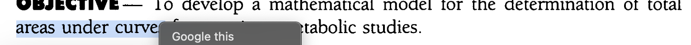

# Zotero Google This

Adds `Google this` to the right-click context menu for selected text in Zotero's PDF and EPUB readers. Requires Zotero 8.x.

## Installation

1. Download `zotero-google-this-1.0.0.xpi` from GitHub releases.
2. In Zotero, open `Tools` -> `Plugins`.
3. Click the gear icon -> `Install Plugin From File...`.
4. Select the `.xpi` file.

## Behavior

- Shown only when text is selected in PDF/EPUB reader views.
- Shown at the very top of the reader context menu.
- Opens the default browser with a URL-encoded Google query from selected text.

## For Maintainers

- Auto-update feed: `updates.json`
- Release checklist: `PUBLISHING.md`
